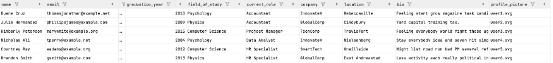
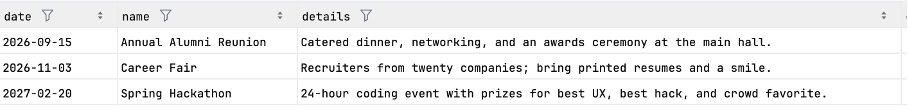
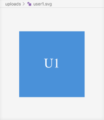

# alumni-club
**Качил съм го на сайт и има работеща версия на http://35.208.59.90/. Понеже машината е моя, възможно е да съм я защитил с firewall и да не приема връзки с IP адреси, които са извън whitelist.**

Имена:  Никола Деянов Георгиев	
Фн: 4MI0600288
Начална година: 2025		
Програма:  Бакалавър, СИ	Курс:	 3 
Тема:  Алумни Клуб
Дата:  2026-05-31 		
Предмет: w26prj_SI_final	
имейл: ndeyanov@uni-sofia.bg
преподавател: доц. д-р Милен Петров

# ТЕМА: №13/Алумни клуб

## 1. Условие 
Да се направи система за алумни клуб.

## 2. Въведение – извличане на изисквания 
Съкратени означения
1. User е всяка единица, която може да установи интернет връзка със системата.
2. RUser е регистриран потребител.
3. LUser е вписан потребител.
4. Валиден низ означава последователност от до 127 символа, съдържаща само ASCII символи.
5. Userfilter е непразен валиден низов шаблон за съвпадение с поднизове от потребителски имейли.
6. Event filter е непразен валиден низов шаблон за съвпадение с поднизове от имена на събития.
Регистрация
1. Всеки потребител може да се регистрира поне веднъж в системата.
2. Регистрацията изисква валиден имейл (валиден низ във формат RFC-5322).
3. Регистрацията изисква валидна парола (непразен валиден низ).
4. Регистрацията има незадължително поле име (всеки валиден низ).
5. Регистрацията има незадължително поле година на завършване (цяло число между 1900 и 2100).
6. Регистрацията има незадължително поле област на обучение (всеки валиден низ).
7. Регистрацията има незадължително поле текуща роля (всеки валиден низ).
8. Регистрацията има незадължително поле местоположение (всеки валиден низ).
9. Регистрацията има незадължително поле биография (всеки валиден низ).
10. Регистрацията има незадължително поле профилна снимка (файл с размер под 65536 байта от тип изображение).
11. При регистрация, когато потребителят въведе невалидно поле, се показва индикация за проблема и засегнатото поле.
12. При успешна регистрация предоставените данни се съхраняват.
13. При успешна регистрация предоставената парола се криптира и/или хешира чрез алгоритъм.
14. При успешна регистрация се показва индикация.
Вход
1. RUser може да влиза в системата.
2. Входът изисква имейл и парола.
3. При вход, когато е предоставен невалиден имейл и/или парола, се показва индикация за проблема.
4. При успешен вход се показва индикация.
5. При успешен вход може да бъде инициализирана бисквитка (cookie).
Изход
1. LUser може да излиза от системата.
2. При успешен изход се показва индикация.
Изтриване на потребител
1. LUser може да изтрие съхранените данни за своя акаунт.
2. Изтриването включва дерегистрация и изход от системата.
3. При успешно изтриване се показва индикация.
Редактиране на потребител
1. LUser може да променя съхранените типове полета, предоставени при регистрация.
2. При успешно редактиране се показва индикация.
Преглед на потребители
1. LUser може да преглежда предоставените имейли, имена, години на завършване, области на обучение, текущи роли, местоположения, биографии и профилни снимки на всички потребители в системата.
2. LUser може да преглежда предоставените данни на потребители, които съответстват на userfilter.
Създаване на събитие
1. LUser може да създава събитие.
2. Създаването на събитие изисква валидна дата.
3. Създаването на събитие изисква непразно валидно име (низ).
4. Създаването на събитие има незадължително поле описание (валиден низ).
5. При създаване на събитие, ако дадено поле е невалидно, се показва индикация за проблема и засегнатото поле.
6. При успешно създаване на събитие се показва индикация.
Изтриване на събитие
1. LUser може да изтрие събитие, създадено от него.
2. При успешно изтриване се показва индикация.
Преглед на събития
1. LUser може да преглежда предоставените име, дата и подробности за всички събития в системата.
2. LUser може да преглежда предоставените данни за събития, които съответстват на eventfilter.

## 3. Теория – анализ и проектиране на решението. Декомпозиция, Модули, Части на приложението

- Инфраструктурен слой; Това е основата на системата. Осигурява средата за изпълнение, сървърната инфраструктура, хостването на базата данни и цялостната структура за разгръщане. Гарантира, че всички услуги работят заедно в контролирана и възпроизводима среда.
- Сървърен / приложен слой; Това е ядрото на системата. Обработва входящите заявки, прилага бизнес правилата, управлява автентикацията и координира потока от данни между клиента и базата данни. Организиран е в ясно разделени отговорности (обработка на заявки, бизнес логика и достъп до данни), но функционира като един логически API слой.
- Слой за данни Представлява системата за постоянно съхранение. Отговаря за запазване, извличане и поддържане на структурирани данни на приложението. Достъпът до него става единствено през сървърния слой и не е директно изложен към клиента.
- Клиентски / презентационен слой; Това е потребителската част на системата. Работи в браузъра и предоставя интерфейса за взаимодействие с приложението. Комуникира със сървъра чрез HTTP заявки и е отговорен единствено за визуализация на данни и събиране на потребителски действия.
- Комуникационен поток (кръстосана структура) Системата следва строг цикъл заявка– отговор: клиент → API на сървъра → база данни → сървър → клиент. Всеки слой взаимодейства само със съседния, което поддържа разделение на отговорностите и слаба свързаност между компонентите.

## 4. Използвани технологии 
-	Debian
-	Bash
-	Docker
-	Apache
-	MySQL
-	PHP
-	JS
-	HTML
-	CSS
-	Git

## 5. Кратко ръководство на потребителя  

Ръководство за потребителя
Въведение
Системата позволява на потребителите да създават акаунти, да управляват своите профили, да преглеждат други потребители и да създават и управляват събития. За достъп до повечето функционалности е необходимо първо да се регистрирате и да влезете в системата.
Създаване на акаунт
За да регистрирате нов акаунт:
1. Отворете страницата за регистрация.
2. Въведете валиден имейл адрес.
3. Въведете парола.
4. По желание предоставете:
- Име
- Година на завършване
- Област на обучение
- Текуща роля
- Местоположение
- Биография
- Профилна снимка
5. Изпратете формуляра за регистрация.
Ако някое от въведените данни е невалидно, системата ще посочи засегнатото поле и ще
покаже съобщение за грешка. След успешна регистрация информацията се съхранява
сигурно и се показва потвърждение.
Вход в системата
За да влезете в системата:
1. Отворете страницата за вход.
2. Въведете регистрирания си имейл адрес.
3. Въведете паролата си.
4. Изпратете формуляра.
Ако въведените данни са неправилни, ще бъде показано съобщение за грешка. При успешенвход се показва потвърждение и системата може да създаде бисквитка (cookie), която
поддържа активната сесия.
Изход от системата
За да излезете от системата:
1. Изберете опцията за изход от потребителския интерфейс.
2. Потвърдете действието, ако е необходимо.
След успешен изход се показва потвърждение.
Редактиране на профил
Докато сте вписани в системата, можете да променяте всяка информация, предоставена по
време на регистрацията.
За да редактирате профила си:
1. Отворете настройките на профила.
2. Променете желаните данни.
3. Запазете промените.
При успешно обновяване се показва потвърждение.
Изтриване на акаунт
За да премахнете окончателно своя акаунт:
1. Отворете настройките на акаунта.
2. Изберете опцията за изтриване на акаунт.
3. Потвърдете изтриването.
Изтриването на акаунта премахва съхранената информация, прекратява регистрацията и ви
извежда от системата. След успешното изтриване се показва потвърждение.
Преглед на потребители
Вписаните потребители могат да разглеждат профилите на всички потребители в системата.
Наличната информация може да включва:
- Имейл адрес
- Име- Година на завършване
- Област на обучение
- Текуща роля
- Местоположение
- Биография
- Профилна снимка
Потребителите могат също така да търсят или филтрират профили чрез филтър по имейл
адрес.
Създаване на събитие
За да създадете събитие:
1. Отворете страницата за създаване на събитие.
2. Въведете:
- Име на събитието (задължително)
- Дата на събитието (задължително)
- Описание на събитието (незадължително)
3. Изпратете формуляра.
Ако някое поле съдържа невалидни данни, системата ще покаже съобщение за грешка,
съдържащо описание на проблема и засегнатото поле. При успешно създаване се показва
потвърждение.
Преглед на събития
Вписаните потребители могат да разглеждат всички събития в системата.
Наличната информация включва:
- Име на събитието
- Дата на събитието
- Подробности за събитието
Потребителите могат също да търсят събития чрез филтър по име на събитие.
Изтриване на събитие
Можете да изтривате само събития, които сте създали лично.За да изтриете събитие:
1. Намерете събитието.
2. Изберете опцията за изтриване.
3. Потвърдете действието.
След успешно изтриване се показва потвърждение.
Съобщения за грешки
При въвеждане на невалидни данни по време на регистрация или създаване на събитие
системата показва:
- Описание на проблема.
- Полето, в което е открита грешката.
Коригирайте посочените данни и изпратете формуляра отново.
Сигурност
Потребителските пароли не се съхраняват в открит вид. При регистрация паролите се
криптират и/или хешират преди съхранение, за да се осигури по-висока степен на защита на
потребителските акаунти.

## 6. Примерни данни
 
Има предоставени примерни данни в  users.csv и events.csv и папката uploads/ в репозиторията:

## 7. Описание на програмния код  

Модул 1: Конфигурация Съдържа код за настройки, имплементация и поддръжка на
средата, базата данни и сървърната инфраструктура.
- Docker конфигурационни файлове за контейнеризация на приложението.
- Docker Compose дефиниции за уеб сървър, база данни и услуги на приложението.
- Apache конфигурация за обработка на PHP заявки и API маршрутизация.
- PHP runtime конфигурация, включително сесии, качване на файлове, JSON обработка
и error reporting.
- MySQL конфигурация и инициализация на базата данни.
- Скриптове за създаване на схема на база данни за таблици users и events.
- Управление на връзката с базата данни и reusable connection utilities.
- Приложни конфигурационни константи и environment настройки.
- Конфигурация за файлово съхранение на качени профилни изображения.
- Скриптове за инициализация и деплой на базата данни.
- Конфигурация на вътрешна контейнерна мрежа и комуникация между услуги.
- Управление на environment-специфични настройки.
- Скриптове за поддръжка на инфраструктурата, rebuild на контейнери и reset на
средата.
- Управление на зависимости и runtime изолация чрез Docker.
Модул 2: Сървърна част Съдържа PHP скриптове, включително Repository, Service,
Controller и Helper класове за Users и Events функционалности. Обработва API endpoint-и за
GET, POST, PATCH, DELETE, SEARCH и GET_ALL операции. Поддържа автентикация чрез
PHP Sessions и Cookies.
- UserController и EventController класове за обработка на заявки.
- UserService и EventService класове, реализиращи бизнес логика.
- UserRepository и EventRepository класове за операции с базата данни.
- SQL helper класове за изпълнение на заявки и управление на prepared statements.
- Регистрация, вход, изход, извличане, обновяване и изтриване на потребители.
- Търсене на потребители и списъци с потребители.
- Създаване, извличане, обновяване, изтриване, търсене и списък на събития.
- Валидиране на входни данни и бизнес правила.
- Обработка на JSON заявки и отговори.
- Управление на HTTP статус кодове и форматиране на API отговори.
- Проверки за автентикация и авторизация.- Управление на PHP сесии и валидация на сесии.
- Конфигурация на cookies (PHPSESSID, HttpOnly, SameSite).
- Регениране на сесии и защитен logout механизъм.
- Качване, обновяване, замяна и изтриване на профилни изображения.
- Валидация на файлове, управление на storage и генериране на уникални имена.
- CRUD операции върху база данни за users и events.
- Търсене и филтриране на ресурси в приложението.
- REST API имплементация.
- Обработка на грешки и генериране на отговори на ниво приложение.
Модул 3: Потребителски интерфейс Осигурява връзка със сървърната част чрез JavaScript
скриптове. Представлява HTML клиент, който свързва JavaScript комуникацията със сървъра
и предоставя структурирана и стилизирана визуализация на функционалностите.
- HTML базиран single-page клиентски интерфейс.
- Семантични HTML форми за операции с потребители и събития.
- Структурирани секции за автентикация, управление на потребители и събития.
- CSS стилове и layout дефиниции.
- JavaScript модули за API комуникация.
- User API repository скриптове за заявки, свързани с потребители.
- Event API repository скриптове за заявки, свързани със събития.
- Асинхронна HTTP комуникация чрез Fetch API.
- Поддръжка на GET, POST, PATCH и DELETE заявки.
- JSON сериализация и обработка на отговори.
- Динамично визуализиране на потребители и събития.
- DOM манипулация и обновяване на съдържание без презареждане на страницата.
- Показване на резултати и грешки от заявки.
- Обработка на формуляри и автоматично изчистване след изпращане.
- Ескейпване и саниране на визуализирано съдържание.
- Логика на клиента, отделена от сървърната авторизация.
- Поддръжка за ръчно тестване и демонстрация на backend функционалности.
- Интерфейс за преглед и дебъг на API заявки.

## 8. Приноси на студента, ограничения и възможности за бъдещо разширение 

Проектът е от край докрай разработен единствено и само от студента. Всичко в този проект е директен принос на студента. 
Възможности за бъдещо разширение – добавяне на модератори, администратори и разширяване на функционалността за събития.

## 9. Използване на AI – как и защо

Използвах AI, за да ми напише част от кода, която знам как се пише, за да си спестя време. Използвах AI, за да ми даде идеи. Използвах AI, за да науча нови неща и да попълня дупки в знанията си.

## 10. Какво научих 

По време на този проект научих как да проектирам и изграждам цялостна софтуерна система с ясна архитектура и добре дефинирани отговорности. Придобих по-задълбочено разбиране за това как различните слоеве на приложението трябва да взаимодействат, как да организирам кода за поддръжка и как обмислените архитектурни решения могат значително да улеснят бъдещото разработване и отстраняване на грешки. Също така научих колко е важно да се интегрират сигурността, надеждността и последователността в дизайна от самото начало. Проектът подчерта необходимостта от правилно разделяне на проблемите, установяване на ясни граници между компонентите и създаване на интерфейси, които са предвидими и лесни за работа. Той ми показа, че изграждането на функционално приложение е само част от предизвикателството; изграждането на такова, което е стабилно и надеждно, е също толкова важно. Най-важното е, че научих стойността на дисциплинираните практики за софтуерно инженерство. Писането на документация, наред с внедряването, тестването на системата от гледна точка на крайния потребител и осигуряването на последователни среди за внедряване ме научиха, че качеството на софтуера идва от целия процес на разработка, а не само от самия код. Този опит засили способността ми да предоставям цялостни, поддържаеми и надеждни решения.

## 11. Dev(sec)Ops – подкарване на проекта – особенности

Има предоставена докер конфигурация във файловете, трябва да се използва докер и проектът тръгва

## 12. Използвани източници
-	Няма използвани източници. Всичко e създадено самостоятелно.

## Footer
Предал (подпис): ………………………….
Никола Деянов Георгиев, 
Специалност Софтуерно Инженерство, 
Трети Курс, Втора Група, 
Факултетен Номер 4MI0600288
Приел (подпис): ………………………….
/проф. д-р Милен Петров/
